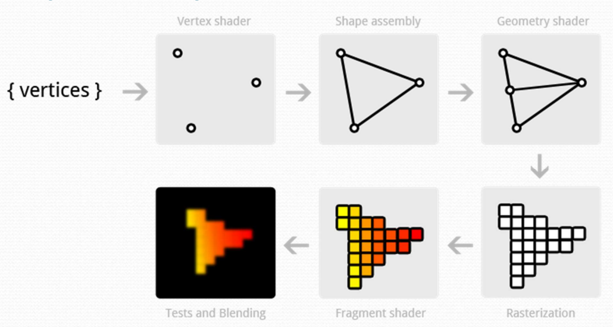
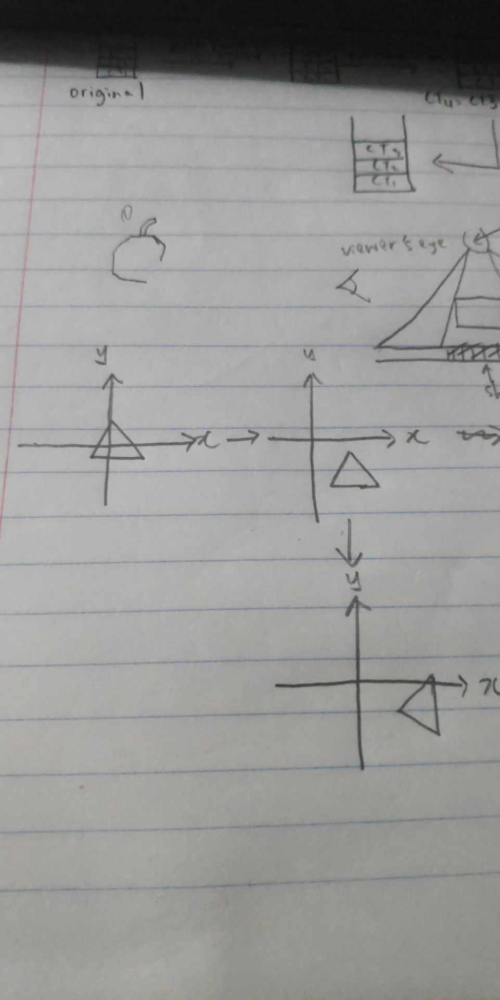

# Q1

## a

### i
- Computer Aided Diagram
- Game
- Animation
- Data visualization

### ii
- More immersive experience
- More attractive than just word

## b

- Vertex Processor
  - Coordinate Transformation
  - Color computation for each vertex
  - Generate and transform texture coordinate
- Clipper and Primitve Assembler
  - Primitive assembler: Generate OpenGL primitives by using the vertex and connectivity information from the vertex processor
	- Clipper: clip against view frustum
- Rasterizer
  - Determine the fragments and the pixel postion of the primitive
  - Rasterizer must determine which pixel in the frame buffer are inside the polygon solid color
- Fragment Processor
  - Take the Fragment generated by rasterizer, interpolate the fragment information and updates pixel data in the frame buffer before actually displaying them on the screen
  - Performs tests
    - Alpha test (translucency)
    - Depth test
    - Stencil test

## c
- Yes, I agree with the statement above. Representing 3D graphics is actually rendering 2D images on the computer screen that provides an illusion of depth, and can be done through projection, which is done by using a fake camera model

# Q2

## a

### i
- Translation
  - `glTranslatef(x, y, z)`
  - translation is to move position of the plane
  - paramater x,y,z are representing x-axis, y-axis, z-axis, the user can input the value for each parameter to decide how much the the plane moves in the responding axis
- Rotation
  - `glRotatef(angle, x, y, z)`
  - Rotates the view by angles (in degrees), around the specified vector {x, y, z}


### ii
```cpp
glRotatef(90, 0, 0, -1);
glTranslatef(0.5, -0.2, 0);
glBegin(GL_TRIANGLES);
glVertex2f(-0.5, 0);
glVertex2f(0, 0.5);
glVertex2f(0.5, 0);
glEnd();
```

### iii

- rotation shud be clockwise, but diagram is anticlockwise (blame soon chee)

## b
- yes, OpenGL matrix stack allow the isolation of transformation on different objects. When the user want to perform a transformation on an object, the user can execute the push command to save the transformation matrix that the user want to perform on the object into the matrix stack. Once the user does not want the transformation to affect other objects, the user can execute the pop command to remove the transformation matrix from the matrix stack.

# Q3

## i
- realism
  - If realism is important, use perspective as it appears to be more realistic (objects further is rendered smaller)
- distance
  - If distance and dimension is an important factor, use orthographic as it preserves those aspects (objects rendered same size regardless of distance from viewer)
- usage
  - Use for VR -> more realistic -> use perspective
  - Use for floor plan design -> more accurate -> use orthographic
- dimension
  - use for 3D -> perspective
  - use for 2D / 2.5D -> orthographic

## ii
- orthographic projection
  - dimensions are preserved
- perspective projection (suggest this)
  - realistic

## iii
- environmental mapping (cube mapping)
  - allow the object to reflect the surrounding environment without modeling the physics
  - Assumes environments are infinitely distant from the objects, which is suitable to be used to represent the sky box since sky is infinitely away from us

## iv
- point sampling
  - use value of closest texel to one computed by the bilinear interpolation
  - fastest strategy
  - `glTexParameteri(GL_TEXTURE_2D, GL_TEXTURE_MAG_FILTER, GL_NEAREST)`
  - `glTexParameteri(GL_TEXTURE_2D, GL_TEXTURE_MIN_FILTER, GL_NEAREST)`
- linear filtering
  - use weighted average of a group of texel in the neighbourhood of texel determined by point sampling
  - smoother, less aliased
  - `glTexParameteri(GL_TEXTURE_2D, GL_TEXTURE_MAG_FILTER, GL_LINEAR)`
  - `glTexParameteri(GL_TEXTURE_2D, GL_TEXTURE_MIN_FILTER, GL_LINEAR)`

# Q4

## a

### i
```cpp
float dif[] = { 0, 0, 1 };
float posD[] = { 0, 0.5, 0 };

glEnable(GL_LIGHTING);
glLightfv(GL_LIGHT0, GL_DIFFUSE, dif);
glLightfv(GL_LIGHT0, GL_POSITION, posD);
glEnable(GL_LIGHT0);
```

### ii
- Flat shaded
  - Simplest way to shade a polygon
  - use the normal associated with the first vertex in the polygon for shading calculation
  - quick
  - lack of realism
  - `glShadeModel(GL_FLAT)`
- Phong shaded
  - normal is calculated for every vertex
  - normal of each pixel is calculated by the linear interpolation from the vertices
  - colour is computated for each pixel
  - Muchhhhhhh slowerrrr
  - much smoother appearance, remove some artifacts
  - no specific command for this

### iii
- Flat shaded
  - flat shaded is very fast, hence it is suitable for real time lighting, where speed is veryy important

## b
- when w is 0, a straight line is drawn from the first to last control point
- when w is between 0 and 1 or 0 and -1, the resulting curve is elliptical
- when w is 1, the resulting curve is parabola
- when w is greater than 1, the resulting curve is hyperbola