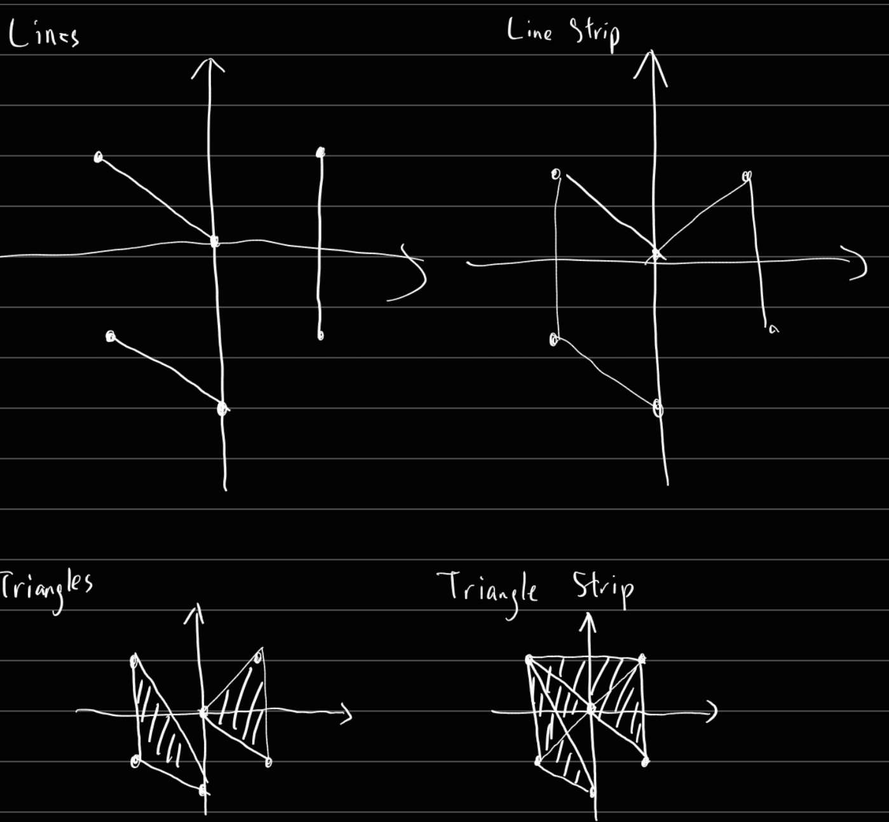

# Q1

## a
- Primitive Assembler
  - Take transformed vertices and connectivity information processed by vertex processor and assmbles them into OpenGL primitives
  - 
- Clipper
  - Clip against view frustum
  - 
- Rasterizer
  - Determine fragment and pixel position of primitive
  - Convert vertices into pixels and store the pixel informations in the form of Fragment
    - Fragment: piece of data that is used by fragment processor to update a pixel in the frame buffer (contains color, normal, texture coordinates)
  - 

## b


## c


# Q2

## a

### i
```cpp
glTranslatef(-0.5, -0.2, 0);
```

### ii
```cpp
glRotatef(45,0,0,-1);
```

## b

### i
- Combines multiple transformations together
- Arbitrary affine transformations matrix can be formed by multiplying of transformation matrices

### ii
- The order of transformation is important
- Different sequence of transformation gives different outputs
- For example, if the object is rotate Z-axis first then translate x, the final result of the object will be the object is rotated but the object is still on x-axis.
- For example, if the object is translate x first then rotate z-axis, the final result of the object will not be on x-axis since it is rotated on the origin.
- Attach the drawing compare two types of order

## c

### i
- By default OpenGL transformations affect the whole frame, not just the individual objects
- We want to isolate the transformations to each objects, so we can use matrix stacks to isolate the transformations to the objects
- For example, we can apply translate to the transformation matrix, save (push) it to the matrix stack then draw the object, we can then apply rotation to the transformation matrix, save it to the stack and draw another object, at this time, the object will be affected by both the translation and rotation, after that we can remove one matrix (pop) from the matrix stack then draw yet another object, this object will no longer be affected by the rotation, but still will be affected by the translation.
- This approach is better than just loading the identity matrix because it allows previous transformations to remain, instead of resetting everything, which is crucial in animation

### ii

- When push matrix command is called to save the transformation into matrix stack, then matrix stack will duplicate the transformation matrix and place it on the top. Then the user can specify the transformation they want, the new transformation matrix will then be apply to the duplicate matrix. Once the user does not want the transformation to affect other objects, the user can pop the matrix out of the matrix stack, which will cause the duplicate matrix to be removed out and the new object will not be affected.

# Q3

## a

### i

- glOrtho(left, right, top, bottom, near, far)

## b

### i
- Flat shaded
  - Simplest way to shade a polygon
  - Use the normal assoicated with the first vertex in the polygon and calculate the shading
  - All pixel in polygon shaded the same
  - Quick
  - Lack of realism
  - `glShadeModel(GL_FLAT)`
- Gouraud Shaded
  - Color is computed for each vertex through the average normal
  - Color for pixels is calculated by the linear interpolation from the vertices
  - Slower than flat shading
  - Smoother appearance across polygon
  - `glShadeModel(GL_SMOOTH)`

### ii
- Processing Speed
- Realism

## c
```cpp
// since texture want terbalik eh
glBegin(GL_QUADS);
  glTexCoords2f(0, 0);
  glVertex2f(0.5, 0.5);
  glTexCoords2f(0, 1);
  glVertex2f(-0.5, 0.5);
  glTexCoords2f(1, 0);
  glVertex2f(0.5, -0.5);
  glTexCoords2f(1, 1);
  glVertex2f(-0.5, -0.5);
glEnd();
```

# Q4

## a
- More compact representation than a set of polygons
- Provide scaleable geometric primitive
- Provide smoother and more continuous primitive than straight lines and planar polygons
- Animation and collision detection is faster, simpler and more accurate
- Save memory for model storage

## b

### i

- Squash the polygon onto the ground plane, draw it darker

### ii
- Z-buffer fighting
  - When depth test is enabled and two polygons are drawn on the same z-value, z-buffer fighting will occur whereby the computer does not know how to actually test the depths and hence sometimes it will draw polygon1 sometimes it will draw polygon2 and hence cause flickering
- Stencil buffer problem
  - Shadow overflow ground polygon

### iii
- Control depth test
  - Disable depth test, draw the ground, draw the decals, draw everything else
- Shift the shadow slightly above the ground
- Stencil buffer
  - Standard OpenGL feature
  - Similar to depth test, done on every pixel
  - Run the test on the new fragments against stencil buffer value, failing fragment will be rejected
  - Avoid drawing the same part of the ground twice, by first rendering the geometry to the stencil buffer, then drawing on where the stencil is set