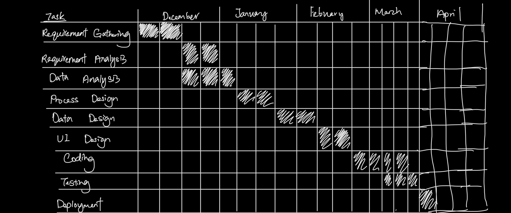

# Q1

## a
- Bespoke product
- The product allows the customer to customized the requirement of the system
- The product is commissioned by the customer to meet their own needs
- The product will only be owned by the customer and will not be sold to anyone who wants to buy them

## b
- Not covered

## c
- Rapid application development
- The system is required to be deliver within 3 months
- The requirements are well known
- The man power of the development team is enough
- The high and low of the management is excited so they can provide feedback

## d
- Availability
	- The system should be able to operate when the user need to use it
- Secure
  - Protected against errors
  - Can withstand attacks from external parties
- Functional
  - Perform function that it is required to
- Economical
  - Running cost not high
- Efficient
	- Low processing time

## e
- physiological needs

# Q2

## a
- interview
  - Interview the user to get blablabla
- scenario
  - Relate to real life examples
- Ethnography (obeserving)
	- Obeserve how the user use the system and through it to identify their working habit and current system pain point
  - Identifies social and organisational requirements
- prototype
  - back and forth process to get requirements when user does not precisely know what they want

## b
- Functional Requirement
	- The system should allow the user to input the personal information to register themselves as a member
	- The system should allow the user to pay their fee through credit or debit card or e-wallet
	- The system should allow the user to check their class schedule through input the class code
- Non Functional Requirement
	- The system should be able to ensure the information of the customer is secured
	- The system should be able to process the input within 0.0000000001 second.

## c
- cry? tq chalit

## d
- Online learning system
- Indirect viewpoint
	- Staff
	- Customer
- Interactor viewpoint
	- Manager
	- Stakeholder
- Domain viewpoint
	- UI standard
	- Legal standard

# Q3
## a
- Module Independence	
	- High cohesion, low coupling
  - Encourages isolation of changes, high modifiability
  - Change of one module will not have insane impacts on other modules as the changes are isolated and localised to their specific areas
- High level programming language
  - Easier to read
  - Robust IDE support
- Staff stability
  - Low turnover of staff reduce probability of needing to hire new staffs with little knowledge about the codebase
- Documentation quality
- Age of programme
	- Older programme does not use latest software engieering technique so it is hard to find staff with the knowledge
- Programming Style
	- good program structure, low maintanence cost 
- Hardware stability

## b
- Cohesion
  - Cohesion refers to the degree of the components in a module depends on each other
  - High cohesion stands that the code inside the module only focus on perform one task
  - Components within a module is tightly related to each other
- Coupling
  - Coupling refers to the degree of dependancy between two modules
	- Low coupling means that two different modules are independent of each other
  - When modify the code in the module, it will not affect the behaviour of other module
	
## c
- diagram: pls refer to note pg 89 in chp 10
- action taken: software re-engeering, this is because the quality of the software is poor but the business value of the system is high

## d
- Repository Model
	- this is because respostory model is the effective way to handle large amount of data since the system store large amount of data (1980 -> current year)
	- it allow centralised management as the maintenance to the central respository will only need to be done once
	- the sub-system does not need to concern how the data is produced
	- sharing model is estalish as respository schema, which is based on a well- defiened schema that specified how the data is stucture

## e
- user familarity
  - Use familiar terms
- consistent
	- the element use in the user interface should have apply UI principle consistency so that the learning curve of the system can be reduced.
- minimal surprise
	- the system should not shut down or execute the function by itself
- recoverability
  - Allow the user to recover from error
- user guidance
	- the system should provide help facilities to the user
- user diversity
  - Design cater to all types of users

# Q4

## a
- Stimuli: clock time between 6pm to 8 am
- Response: the dim light will be turn on if the time is night, motion detector turn on

- Stimuli: clock time between 8am to 6pm
- Response: the light will be turned off, motion detector will be turned off

- Stimuli: motion detected
- Response: the light will be adjusted to a bright light

## b
- Project management tool
  - visio
  - microsoft project
- Prototyping tool
  - figma
  - protobuf

## c
- Black box testing
  - Rely on system or component specification that is being tested to derive the test cases (to find out the input and output to test)
  - System behaviours are identified by studying the input and the related outputs
  - Eg
    - Functionality testing
    - Security testing
- Stress test
  - overload the system by going beyond the specified limits
  - tests how well the system cope with the overload situation