# Q1
## a
- Static aspect
	- Include state that a system can occupy
	- Constraint relationship that is maintain when the system move from state to state
	- Mostly seen in the state space schema
- Dynamic aspect
	- Operations that are possible
	- Relationship between input and output
	- Changes of state that happens in terms of the pre and post conditions
	- Mostly seen on the operation schema

## b
- domain restriction is get elements from the domain, ◁
- switch the position of domian aain and range, ~
- range antirestriction is remove elements from the range, ⩥
- composition combines two relations by merging two entities that share a same component, ⨾

## c
- injection
	- it means one to one relationship
	- the element in the domain will only link to one specific element in range and the element in range will only link with one element in domain
	- the some elements in range in the injection relationship may not link with the elements in domain
- surjection
	- it means onto
	- all elements in the range will link to an element in the domain
	- there is a possible that more than one element in the range link to the same element in the domain

## d
### i
- partial function, students will enroll in programme

### ii
- binary relation, one journal can be cited by many other journals and one journal can cite many other journals

### iii
- total function, all different country will have a unique capital city

# Q2
## a
```latex
\begin{schema}{NewMember}
\Delta MembershipCard \\
newMemberId?: MEMBERID \\
newCardNo?: CARDNO \\
memExpiryDate?: DATE
\where
newMemberId? \notin memberId \\
newCardNo? \notin \ran cardNo \\
memberId' = memberId \union \set{newMemberId?} \\
cardNo' = cardNo \union \set{newMemberId? \mapsto newCardNo?} \\
cardPoints' = cardPoints \union \set{newMemberId? \mapsto 100} \\
cardCash' = cardCash \union \set{newMemberId? \mapsto 0} \\
expiryDate' = expireDate \union \set{newMemberId \mapsto memExpiryDate?}
\end{schema}
```
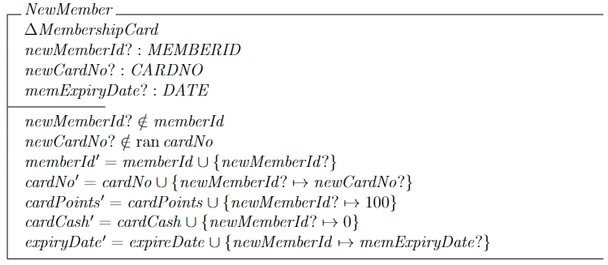

## b
```latex
\begin{schema}{TransferCash}
\Delta MembershipCard \\
m1?, m2?: MEMBERID \\
transferAmount?: \nat 
\where
m1? \in memberId \\
m2? \in memberId \\
m1? \ne m2? \\
transferAmount? \geq 1 \\
cardCash(m1?) \geq 20 \\
cardCash(m1?) - transferAmount? \geq 5 \\
cardCash' = cardCash \oplus \\
    \indent \set{m1? \mapsto cardCash(m1?) - transferAmount?, \\
    \indent m2? \mapsto cardCash(m2?) + transferAmount?} \\
memberId' = memberId \\
cardNo' = cardNo \\
cardPoints' = cardPoints \\
expiryDate' = expireDate
\end{schema}
```
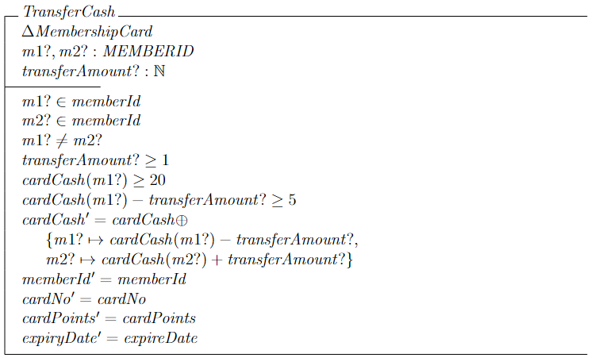

## c
```latex
\begin{schema}{RedeemPoints}
\Delta MembershipCard \\
memId?: MEMBERID \\
pointToRedeem?: \nat \\
\where
memId? \in memberId \\
pointToRedeem? \geq 250 \\
cardPoints(memId?) \geq pointToRedeem? \\
cardPoints' = cardPoints \oplus \set{memId? \mapsto cardPoints(memId?) - pointsToRedeem?} \\
cardCash' = cardCash \oplus \set{memId? \mapsto cardCash(memId?) + pointToRedeem / 250} \\
memberId' = memberId \\
cardNo' = cardNo \\
expiryDate' = expireDate
\end{schema}
```
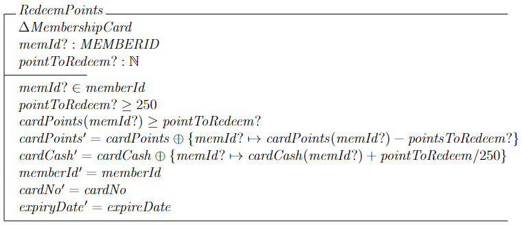

# Q3
## a
```latex
\begin{schema}{UpdatePoints}
\Delta MembershipCard \\
memId?: MEMBERID \\
totalAmount?: \nat
\where
memId? \in memberId \\
totalAmount? \geq 2 \\
cardPoints' = cardPoints \oplus \set{memId? \mapsto cardPoints(memId?) + totalAmount / 2} \\
memberId' = memberId \\
cardNo' = cardNo \\
cardCash' = cardCash \\
expiryDate' = expireDate
\end{schema}
```
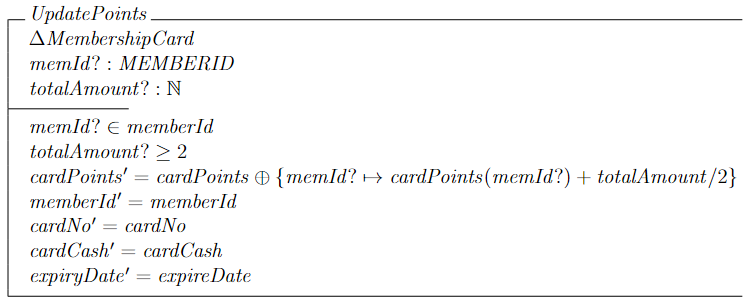

## b
```latex
\begin{schema}{TopUpCash}
\Delta MembershipCard \\
memId?: MEMBERID \\
topUpAmount?: \nat 
\where
memId? \in memberId \\
topUpAmount? \geq 5 \\
cardCash' = cardCash \oplus \set{memId? \mapsto cardCash(memId?) + topUpAmount?} \\
memberId' = memberId \\
cardNo' = cardNo \\
cardPoints' = cardPoints \\
expiryDate' = expireDate
\end{schema}
```
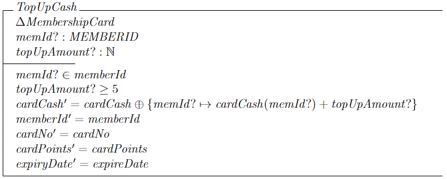

## c
```latex
\begin{schema}{DisplayMembers}
\Xi MembershipCard \\
memIds!: \power MEMBERID \\
\where
memIds! = \set{id: MEMBERID | id \in memberId \\
    \indent @ cardPoints(id) \geq 2000} \\
memberId' = memberId \\
cardNo' = cardNo \\
cardPoints' = cardPoints \\
cardCash' = cardCash \\
expiryDate' = expireDate
\end{schema}
```
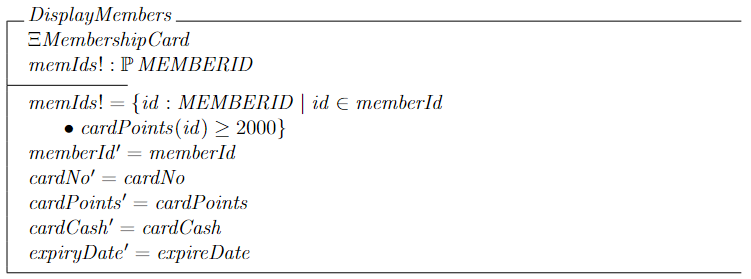

## d
```latex
\begin{schema}{TransferCashExceptions}
\Xi MembershipCard \\
m1?, m2?: MEMBERID \\
transferAmount?: \nat \\
msg!: MESSAGE
\where
(m1? \notin memberId \land msg! = memberNotExist) \lor \\
(m2? \notin memberId \land msg! = memberNotExist) \lor \\
(m1? = m2? \land msg! = invalidCashTransfer) \lor \\
(transferAmount < 1 \land msg! = notFulfilMinimumValue) \lor \\
(cardCash(m1?) < 20 \land msg! = notEnoughCashBalance) \lor \\
(cardCash(m1?) - transferAmount? < 5 \land msg! = notEnoughCashBalance)
\end{schema}

\begin{syntax}
TransferCashComplete \defs (TransferCash \land Ok) \lor TransferCashException
\end{syntax}
```
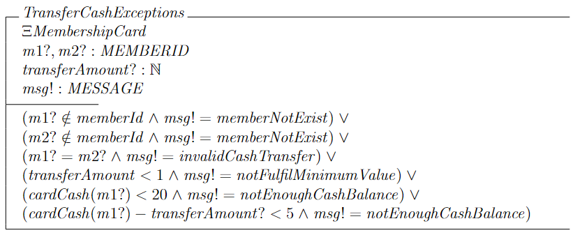
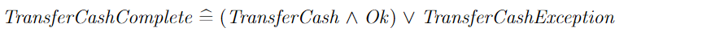

# Q4
## a
- car1 can be any car. Eg. car1 == {IAmACar}
- car2 is a sequence of cars that the order matters and does not have duplicates. Eg. car2 == <a, b, c, d>
- car3 is a collection of cars in which the order does not matter and can contain duplicates. Eg. car3 == a, b, c, d

## b
### (1)
- The same driver cannot rent two different cars at the same time (if simplify and use full plain english)
- For all car models, it is true that if any two car models is not the same is true, the driver of the rented car is not the same is true (if direct translate the symbols)
- If the two car model is different, the two driver of the car is different

### (2)
- The number of a rented car model cannot exceed its available car quantity

## c
### i
```latex
\begin{schema}{TrophyMedal}
products: \bag PRODUCT \\
category: PRODUCT \pfun CATEGORY \\
design: PRODUCT \pfun DESIGN \\
price: PRODUCT \pfun \nat
\where
\dom products = \dom category = \dom design = \dom price
\end{schema}
```
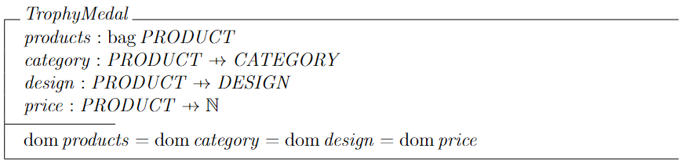

### ii
```latex
% simple version (dk which correct)
\begin{schema}{Restock}
\Delta TrophyMedal \\
restockProd?: PRODUCT \\
lowStockTreshold?: \nat
\where
restockProd? \inbag products \\
products\#restockProd? < lowStockTreshold \\
products' = products \uplus \lbag restockProd? \rbag \\
category' = category \\
design' = design \\
price' = price
\end{schema}

% complicated version
\begin{schema}{Restock}
\Delta TrophyMedal \\
restockProd?: PRODUCT \\
lowStockTreshold?: \nat \\
restockCount?: \nat
\where
restockProd? \inbag products \\
products\#restockProd? < lowStockTreshold \\
products' = products \uplus restockCount? \otimes \lbag restockProd? \rbag \\
category' = category \\
design' = design \\
price' = price
\end{schema}
```
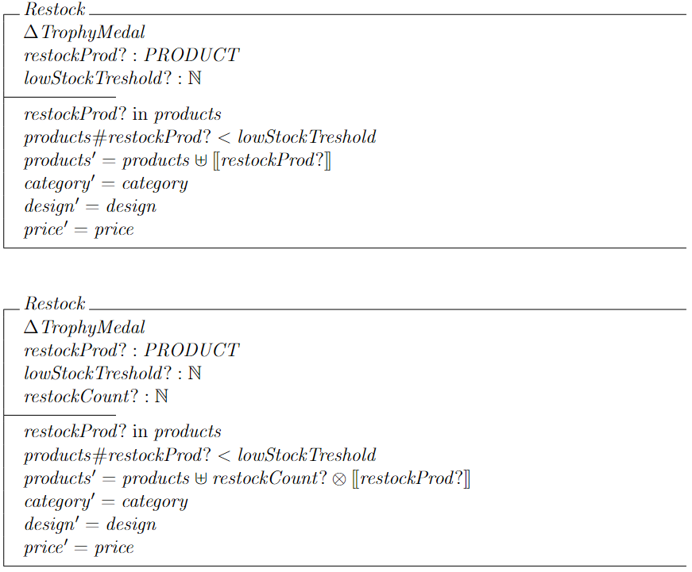

### iii
```latex
\begin{schema}{TotalProduct}
\Xi TrophyMedal \\
restockProd?: PRODUCT \\
productCount!: \nat 
\where
restockProd? \inbag products \\
productCount! = products\#restockProd? \\
products' = products \\
category' = category \\
design' = design \\
price' = price
\end{schema}
```
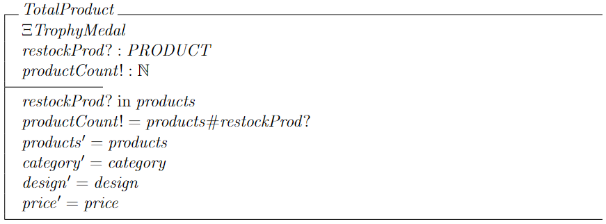
