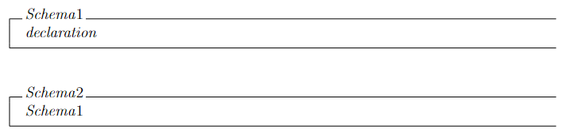
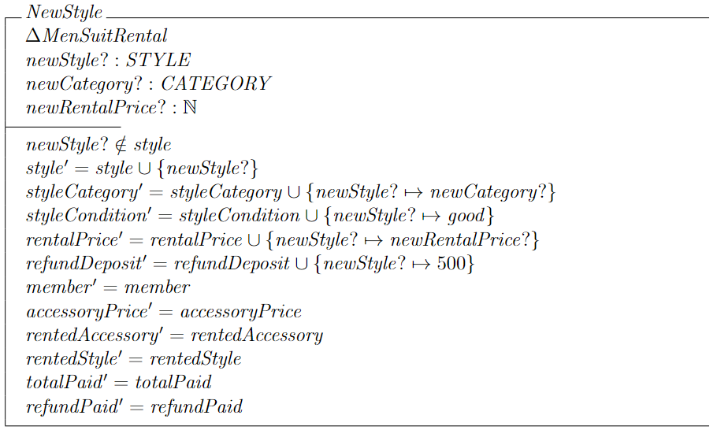
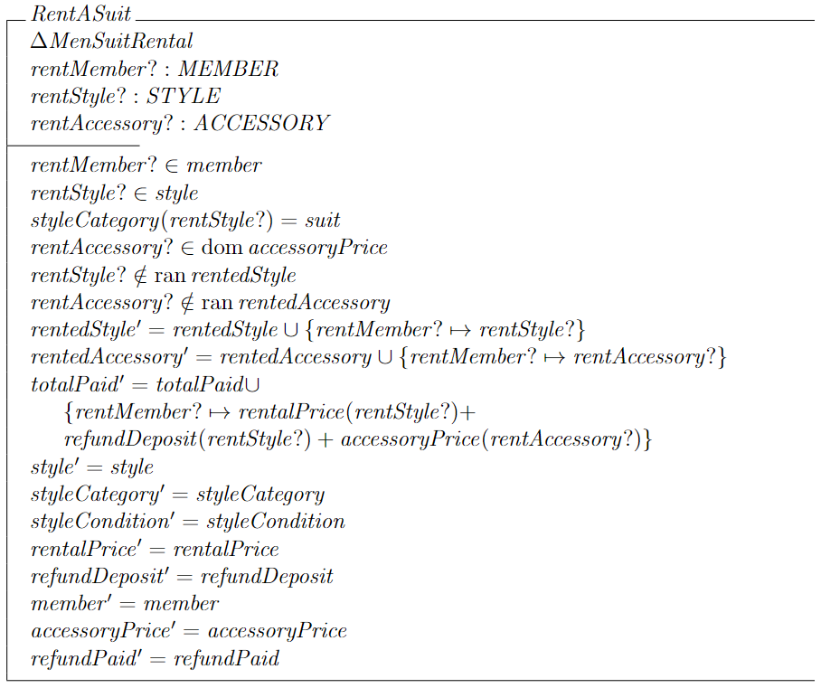
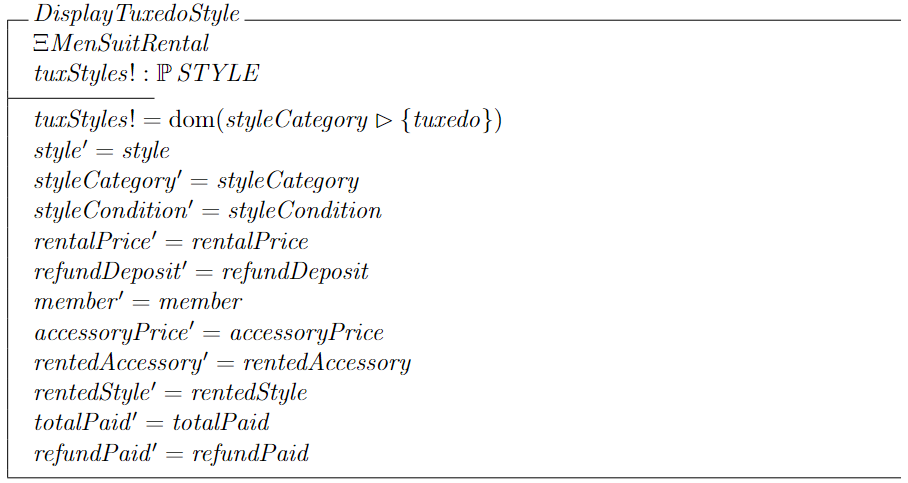
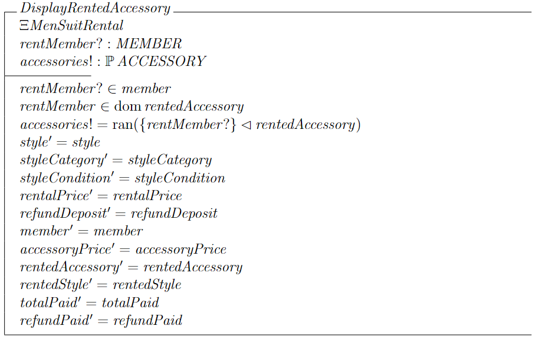
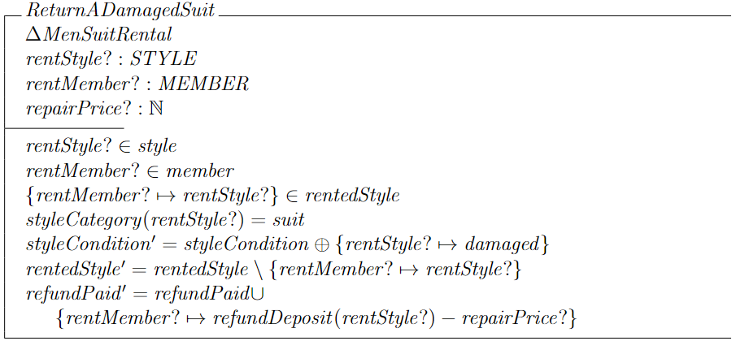
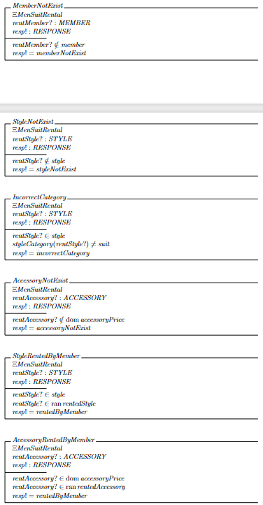
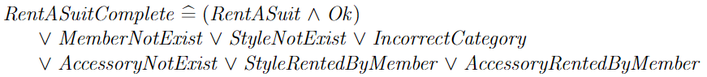

# Q1

## a

### i
- Syntax: Defines the specific notations used for the specification representation and can mechanically processed and checked
- Semantic: Use objects to describe the system in an unambiguous mathematical way
- A set of relation: Use rule to indicate the objects that satisfies the specification

### ii
- Model based specification
	- In model based specification, the system specification is expressed as state machine model and it is constructed with well understood mathematical entities such as set and functions
  - Besides that, the operation is also identify by defining how the operation can transition the system from state to state
  - For example, if the system currently is in logged in state, the user can click on the log out button to leave the logged in state
- Property based specification
  - Describe the operations performed on the system
  - Defines the relationship among the operations
  - For example, log in opperation must come before every other operations and log out must be the last operation performed

## b

### i
- member represents all possible combinations of registered members in the system

### ii
- a registered member will have a card number

### iii
- a registered member will have card points

### iv
- a registered member will have card cash

### v
- a card number will have an expiry date

### vi
- Every member will have a different card number. So, no two different members can have the same card number.

## c
```latex
\begin{schema}{Schema1}
declaration
\end{schema}
\begin{schema}{Schema2}
Schema1
\end{schema}
```

- Schema inclusion means that use a name of other schema in the declaration part of the schema
- For example, we have two schemas called order and customer then we can perform schema inclusion by using the order and customer schema in a new created schema called customer order schema
- In the declaration part of the customer order schema, we can just specify the order and customer schema then the customer order schema will be able to access the properties in the customer and order schema
- For example, based on the schemas I have written, Schema1 is being included in Schema2 and all the declaration of Schema1 will be accessible in Schema2

# Q2
## a
```latex
\begin{schema}{NewStyle}
\Delta MenSuitRental \\
newStyle?: STYLE \\
newRentalPrice?: \nat \\
\where
newStyle? \notin style \\
style' = style \union \set{newStyle?} \\
styleCategory' = styleCategory \union \set{newStyle? \mapsto tuxedo } \\
styleCondition' = styleCondition \union \set{newStyle? \mapsto good} \\
rentalPrice' = rentalPrice \union \set{newStyle? \mapsto 450} \\
refundDeposit' = refundDeposit \union \set{newStyle? \mapsto 500} \\
member' = member \\
accessoryPrice' = accessoryPrice \\
rentedAccessory' = rentedAccessory \\
rentedStyle' = rentedStyle \\
totalPaid' = totalPaid \\
refundPaid' = refundPaid \\
\end{schema}
```


## b
```latex
\begin{schema}{RentASuit}
\Delta MenSuitRental \\
rentMember?: MEMBER \\
rentStyle?: STYLE \\
% very unclear, question said an addition of vest, but the schema name question wants does not suggest that suit to be hardcoded in this schema, so I am taking it as input
rentAccessory?: ACCESSORY \\
\where
rentMember? \in member \\
rentStyle? \in style \\
styleCategory(rentStyle?) = suit \\
rentAccessory? \in \dom accessoryPrice \\
rentStyle? \notin \ran rentedStyle \\
rentAccessory? \notin \ran rentedAccessory \\
rentedStyle' = rentedStyle \union \set{rentMember? \mapsto rentStyle? } \\
rentedAccessory' = rentedAccessory \union \set{rentMember? \mapsto rentAccessory? } \\
totalPaid' = totalPaid \union \\
    \indent \set{rentMember? \mapsto rentalPrice(rentStyle?) + \\
    \indent refundDeposit(rentStyle?) + accessoryPrice(rentAccessory?)} \\
style' = style \\
styleCategory' = styleCategory \\
styleCondition' = styleCondition \\
rentalPrice' = rentalPrice \\
refundDeposit' = refundDeposit \\
member' = member \\
accessoryPrice' = accessoryPrice \\
refundPaid' = refundPaid \\
\end{schema}
```


## c
```latex
\begin{schema}{DisplayTuxedoStyle}
\Xi MenSuitRental \\
tuxStyles!: \power STYLE
\where
tuxStyles! = \dom (styleCategory \rres \set{tuxedo}) \\
style' = style \\
styleCategory' = styleCategory \\
styleCondition' = styleCondition \\
rentalPrice' = rentalPrice \\
refundDeposit' = refundDeposit \\
member' = member \\
accessoryPrice' = accessoryPrice \\
rentedAccessory' = rentedAccessory \\
rentedStyle' = rentedStyle \\
totalPaid' = totalPaid \\
refundPaid' = refundPaid \\
\end{schema}
```


# Q3
## a
```latex
\begin{schema}{DisplayRentedAccessory}
\Xi MenSuitRental \\
rentMember?: MEMBER \\
accessories!: \power ACCESSORY
\where
rentMember? \in member \\
rentMember \in \dom rentedAccessory \\
accessories! = \ran (\set{rentMember?} \dres rentedAccessory) \\
style' = style \\
styleCategory' = styleCategory \\
styleCondition' = styleCondition \\
rentalPrice' = rentalPrice \\
refundDeposit' = refundDeposit \\
member' = member \\
accessoryPrice' = accessoryPrice \\
rentedAccessory' = rentedAccessory \\
rentedStyle' = rentedStyle \\
totalPaid' = totalPaid \\
refundPaid' = refundPaid \\
\end{schema}
```


## b
```latex
\begin{schema}{ReturnADamagedSuit}
\Delta MenSuitRental \\
rentStyle?: STYLE \\
rentMember?: MEMBER \\
repairPrice?: \nat \\
\where
rentStyle? \in style \\
rentMember? \in member \\
\set{rentMember? \mapsto rentStyle?} \in rentedStyle \\
styleCategory(rentStyle?) = suit \\
styleCondition' = styleCondition \oplus \set{rentStyle? \mapsto damaged} \\
rentedStyle' = rentedStyle \setminus \set{rentMember? \mapsto rentStyle?} \\
refundPaid' = refundPaid \union \\
    \indent \set{rentMember? \mapsto refundDeposit(rentStyle?) - repairPrice?}
\end{schema}
```


## c
### i
```latex
% wrong, combine all into one big schema using schema conjunction, name the schema as RentASuitError can already
\begin{schema}{MemberNotExist}
\Xi MenSuitRental \\
rentMember?: MEMBER \\
resp!: RESPONSE 
\where 
rentMember? \notin member \\
resp! = memberNotExist
\end{schema}

\begin{schema}{StyleNotExist}
\Xi MenSuitRental \\
rentStyle?: STYLE \\
resp!: RESPONSE 
\where 
rentStyle? \notin style \\
resp! = styleNotExist
\end{schema}

\begin{schema}{IncorrectCategory}
\Xi MenSuitRental \\
rentStyle?: STYLE \\
resp!: RESPONSE 
\where 
rentStyle? \in style \\
styleCategory(rentStyle?) \ne suit \\
resp! = incorrectCategory
\end{schema}

\begin{schema}{AccessoryNotExist}
\Xi MenSuitRental \\
rentAccessory?: ACCESSORY \\
resp!: RESPONSE 
\where 
rentAccessory? \notin \dom accessoryPrice \\
resp! = accessoryNotExist
\end{schema}

\begin{schema}{StyleRentedByMember}
\Xi MenSuitRental \\
rentStyle?: STYLE \\
resp!: RESPONSE 
\where 
rentStyle? \in style \\
rentStyle? \in \ran rentedStyle \\
resp! = rentedByMember
\end{schema}

\begin{schema}{AccessoryRentedByMember}
\Xi MenSuitRental \\
rentAccessory?: ACCESSORY \\
resp!: RESPONSE 
\where 
rentAccessory? \in \dom accessoryPrice \\
rentAccessory? \in \ran rentedAccessory \\
resp! = rentedByMember
\end{schema}
```


### ii
```latex
% wrong
\begin{syntax}
RentASuitComplete \defs (RentASuit \land Ok) \\
    \indent \lor MemberNotExist \lor StyleNotExist \lor IncorrectCategory \\
    \indent \lor AccessoryNotExist \lor StyleRentedByMember \lor AccessoryRentedByMember
\end{syntax}

% should be like this
\begin{syntax}
RentASuitComplete \defs (RentASuit \land Ok) \lor RentASuitError
\end{syntax}
```


# Q4
## a
### i
```latex
\begin{schema}{HotelCheckIn}
counters: \power COUNTER \\
queue: \seq GUEST \\
checkIn: COUNTER \pfun GUEST
\where
\dom checkIn = counters
\end{schema}
```

### ii
```latex
\begin{schema}{ServeGuest}
\Xi HotelCheckIn \\
checkInCounter?: COUNTER \\
guest?: GUEST
\where
checkInCounter? \in counters \\
queue \ne \langle \rangle \\
guest? = \Head queue \\

queue' = \Tail queue \\
checkIn' = checkIn \union \set{checkInCounter? \mapsto guest?} \\
counters' = counters
\end{schema}
```

> Others can go see the PYQ that Hong Le posted in the classroom