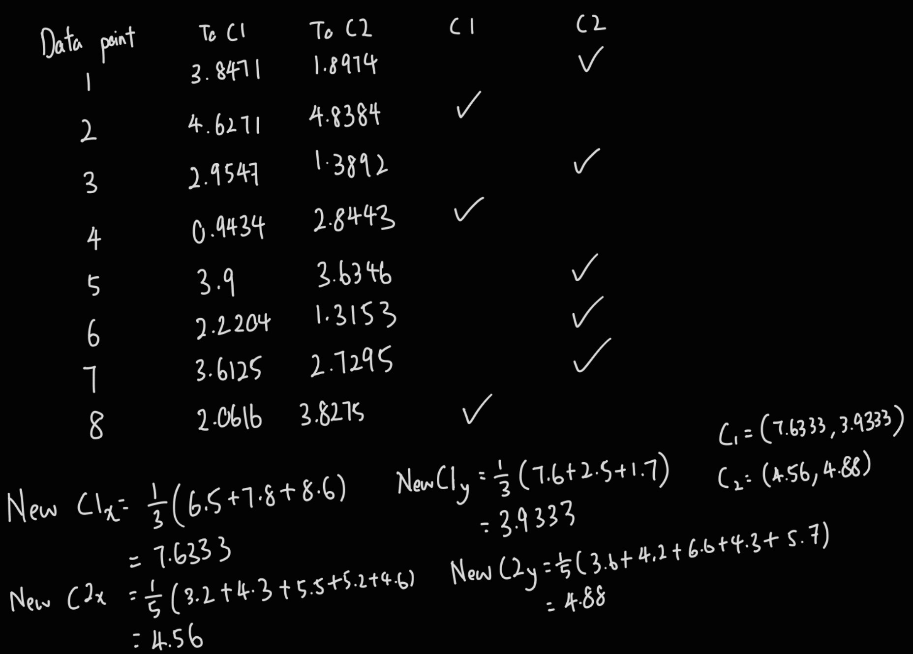

# Q1a
## i
- The turing test involves a person, machine and moderator. The moderator assign the same question to a person and a machine, then let the person and machine answer the question. If the moderator cannot identify which answer is provided by the machine, it means that the machine passed the turing test.

## ii
- The chinese room mentions that the machine can answer the question without the need to understand the question as long there is a instruction book that prepares every answer for all the questions possibly asked.

# Q1b
## i
- Goal: To reach G
- Optimal solution: To reach G with the shortest distance
- Abstraction: The route found does not consider the time required to reach G
- Initial state: The starting point is A, `Go(null, In(A), 0)`
- Successor function: The successor function can be given  as `Go(To(child), In(parent), step_cost), for example Go(To(C), In(A), 5)`
- Goal step: The current point is G
- Step cost: The cost of distance from one node to the other
- Path cost: The total of the distance to move from point A to G

## ii

## iii
- BFS: A -> E -> G
- DFS: A -> C -> H -> G

## iv
- Completeness: The BFS is guaranteed to be complete, it explores all the possible paths. The DFS is not guaranteed to be complete, it can be trapped in an infinite loop or might miss other paths. 
- Optimality: The solution found by BFS is guaranteed to be optimal. The solution found by DFS is not guaranteed to be optimal, it may find a path in the shortest time, but the path found is not guaranteed to be the shortest path.

# Q2
## a
- NLU is a subfield of NLP focused on machine reading comprehension. The goal of NLU is to enable machines to understand and interpret human language in a meaningful way.
  - Function include syntax analysis, sentiment analysis etc.
- NLG is a subfield of NLP that focuses on generating natural language text that is coherent and contextually appropriate.
  - Function include sentence aggregation, text planning, lexical choice etc.

## b
- Semantic ambiguty: The same word can be interpreted with more than one meaning, while the structure of the sentence remain the same. The shot in this sentence can have two meaning first one is shotting and another is taking video or picture.
- Syntatic ambiguty: The same sentence can be interpreted with more than one meaning depending on the context with varying syntactic structures. The sentences can be understood as there is an elephant that is inside my pyjamas getting shot or the elephant is getting shot by me, who is wearing the pyjamas

## c

## d
- Syntax
	- Rules for combining words into legal phrases or sentences e.g. grammer (note)
	- Analyse the structure of the sentences for example grammar
- Semantic
	- Analyse the meaning of the word in the sentences
- World knowledge
	- Understand the meaning of the word represent in world

# Q3
## a
- The supervised learning learn using the dataset that label column and unsupervised learning learn using the dataset that does not contain the label column. 
- The supervised learing is used for classification. The unsupervised learning is used for clustering.
- Supervised learning learn mapping from input to output. Unsupervised learning is used to identify hidden pattern or structure.
- Evaluation of supervised learning through precision, recall. Evaluation of unsupervised learning is hard as we do not know there are how many cluster. 

## b

## c
This is because we does not know there are how many actual cluster in the dataset. Therefore, we cannot determine that the number of cluster provided by the algorithm is correct.

# Q4
## a
- Potential error
  - Blurry or low resolution text
  - Noise in image obstructing the characters
	- Character misalignment
	- Character misrecongnition
- Steps can be taken
	- Enhancing constrast
	- Isolating regions
	- Removing noise
	- Morphological operation
    - Process of simplifying objects by filling in holes or eliminating small protrusions from the boundary
		- Dilation
			- Process of making an object bigger to fill in the holes
		- Erosion
			- Process of making an object smaller by removing the boundary pixels
		- Opening
			- Erosion then dilation
		- Closing
			- Dilation then erosion

## b
$$
CF(\text{loss taste}) = 0.6*0.3 = 0.18 \\
CF(\text{difficulty in breathing or shortness of breath}) = 0.9*0.67 = 0.603 \\
CF(\text{severe headache}) = 0.75*0.56 = 0.42 \\

CF(\text{loss taste}) + CF(\text{difficulty in breathing or shortness of breath}) 
- 
CF(\text{loss taste}) * CF(\text{difficulty in breathing or shortness of breath})
= 0.18 + 0.603 - 0.18 * 0.603 = 0.67446 \\

CF(\text{covid}) = 0.67446 + 0.42 - 0.67446*0.42 = 0.8111868
$$

## c
- crips set identify value in either 0 or 1
- fuzzy set identify value between 0 to 1

## d
- Washing machine can support weights between 0.1 to 10kg, these weights are of 3 levels, low, medium or height
- Fuzzy rules can be used to determine the water level, determined with low, medium or high. 
- Rule 1: IF weight is low THEN water level is low
- Rule 1: IF weight is medium THEN water level is medium
- Rule 1: IF weight is high THEN water level is high
