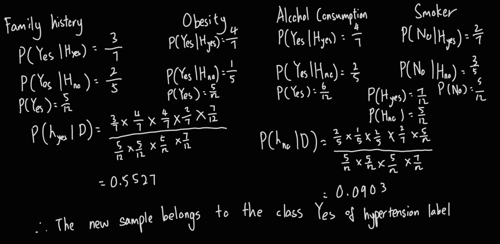
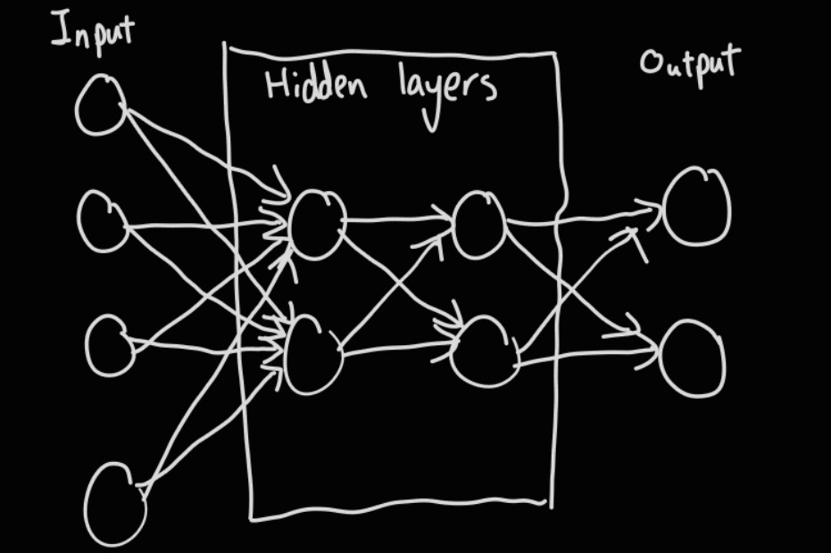

# Q1
## a
- Predict withdraw rate of the student. The school can predict the withdraw rate of the student and provide some assitance for the student that is likely going to withdraw.
- Provide assitance to the student to let the student understand the knowledge. For example, Chat-gpt can provide some additional information about the topic the student ask to have a better undestanding about the topic.

## b
### i
- Goal: To reach station G
- Optimal solution: To reach station G with the shortest distance
- Abstraction: The time required to reach station G is not considered
- Initial state: The starting point is station A, `Go(null, In(A))`
- Successor function: The successor function is `Go(To(children), In(parent))`, for example, `Go(To(B), In(A))`
- Goal test: Check if the current station is station G, `Go(null, In(G))`
- Step cost: Cost required from a point to the next point 
- Path cost: Total of distance to move from A to G

### ii
> skip meow, lazy put picture d

### iii
- Search path
	- BFS: A B C E D F G
	- DFS: A B C D F H G
- Returned path
	- BFS: A C G
	- DFS: A C G

### iv
- Completeness: BFS is guaranteed to be complete and DFS is not guaranteed to be complete
- Optimality: BFS is guaranteed to find the optimal solution and DFS is not guaranteed to find the optimal solution

# Q2
## a
### i
- Semantic network can show a relationship from a concept to another concept

### ii
> skip meow, lazy put picture d

## b
- Syntatic ambiguity: The same sentence can be interpreted as having different structures. This sentence can either be identified as the woman is holding the camera or the man is holding the camera
- Semantic ambiguity: The same word can represent more than 1 meaning. The shot in the sentence can represent fire a bullet or taking a picture. 

## c
> skip meow, lazy put picture d

## d
- Syntax, analyze the structure of the sentences
- Semantic, analyze the meaning of the word

# Q3
## a

> $ P(h_\text{no}|D) $ calculation wrong, sub wrong not smoker one, should be $ \frac{3}{5} $ instead of $ \frac{2}{7} $

## b

## c
$$
\text{accuracy} = \frac{TP + TN}{Total} = 83+64/83+64+10+5 = 0.907
\text{precision} = \frac{TP}{Predicted Yes} = 83/93 = 0.892
\text{recall} = \frac{TP}{Actual Yes} = 83/88 = 0.943
$$

# the rest
> verbally gone through, kena 折磨 by other question until no energy d