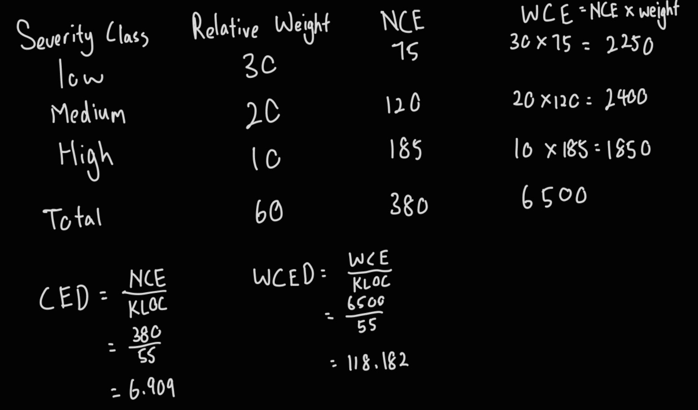
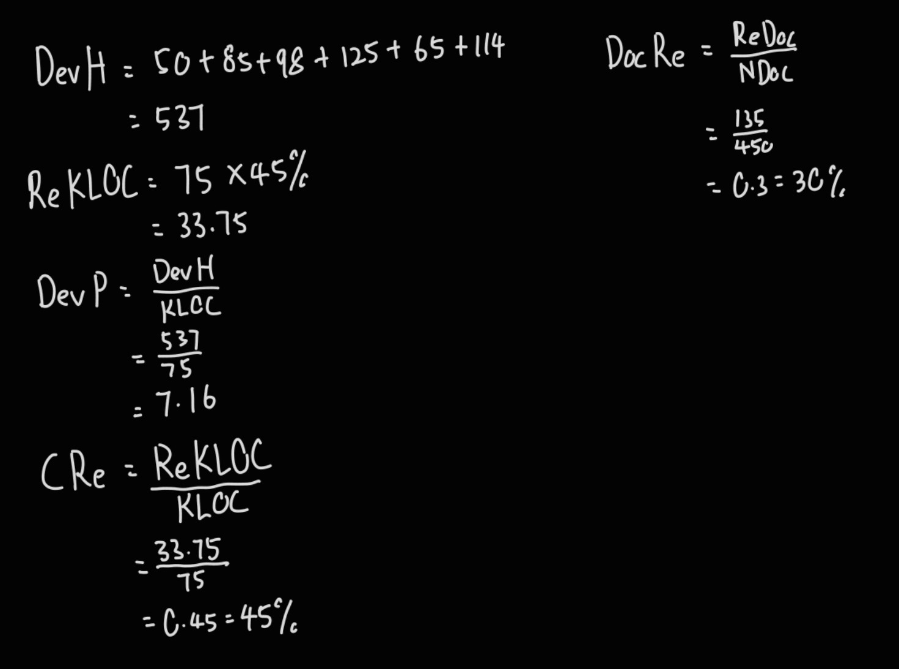

# Q1a
## i
- Testing activity should start as early as possible
	- The statement mentions that the tester should involve in the project as early as possible so that they can start the testing activity as early as possible. By doing that, the tester can start design the test case once the requirements is identify and start the testing once the part of the system is done completed. Therefore, once the testing is performed, the error can be discovered if the error exist and it can be reported to the development team to fix the error and the error can be fix as early as be possible. By doing that, the major bug of the system will be idetify and fix when the system is almost completed development. 

## ii
- In the scenario when the project in the end of development process, if the testing process is just only to start after the development is complete, there might not be enough time to perform testing on all the test cases. By only testing on the high priority test cases, it might cause the system to have some little defects that is not discovered in the tesing process and the system is launch. However, after the system is launch, users discovered there are defects in the system. Therefore, the company might need to require the developers to work overtime to fix those defects hence it increase the time and development budget require.

# Q1b
- Project example: online banking system
- Functional testing: It is the testing activity to used to test whether the fucntion provided by the online banking system work according to the expectation. For example, the tester can test the login function provided by the online banking system.
- System testing: It is a testing activity to test the system as a whole, where the individual modules are integrated and the system is validated such that it meets the requirements of the user. For example, test cases can be created to test the entire system of the online banking system that simulates real world scenarios. 
- User Acceptance testing: It is a testing activity to used to test whether the system is acceptable by the customers and meets their requirement, focusing on usability aspects. For example, the tester can perform alpha testing to invite the customer to test the system on common user scenarios at the developer site and make changes to the system based on their testing feedback.

# Q1c

- Incremental approach
	- Combine next module to be tested with modules previously tested
	- E, C and F is tested first, then B-E and D-F, then A-B-C-D-E-F
- Non Incremental approach
	- All module is tested independently before it is integrated with other module
	- After all modules are integrated as the whole system, test all module as the whole system
	- A, B, C, D, E, F is tested independently, then A-B-C-D-E-F
- Benefits of incremental
	- Detect programming error such as interface problem and misintegration earlier, which will cause debugging process to be easier
	- More thorough testing as the tested module will be tested again in the next testing activity when testing the integration with the other modules in the next incremental

# Q2a 
> Answer not confirm, so won't put here

# Q2b

# Q2c
- Defect priority has three common classes, high, medium and low, where high priority implies that further development or testing is not possible if the defect is not fixed, medium priority implies that the defect should be resolved as soon as possible and low priority implies that the defect can be repaired after all serious defects have been fixed. By assigning one of the class to the defect to show the priority of the defect to be solved.
- By reporting the defects with defect priority, it allow the development team to quickly identify which defects will needed to be resolved first in order to make sure that the testing process can continue conduct.

# Q3a
## i
- SQC is a subset of SQA and both serve different objective
- SQC: Process of evaluating the product to make sure the product achieve its requirements, takes place after the product is completed, before shipping to the customer
- SQA: Objective is to minimize cost of guaranteeing the quality of the product, performed throughout development stages, reducing the rate of shipment of unqualified products

## ii
- Plan testing and SQA processes
	- Test processes should be well defined and documented, documents include quality management plan, test plan and test cases. 
- Implement test-oriented management
	- Apply Extreme Programming methodology with the aim to produce higher quality software with the ability to adapt to changes
	- Test driven development 
		- Test first approaches
		- The new feature begins with write a test case before writing enough code to fulfill the requirements and the test will initially fail
		- The developers now focus on the coding of the feature to make it pass the test
		- Once both process is conducted, refractor the code to pass all the test
	- Pair Programming
- Ensure suitable working environment for the SQA team
	- Involve SQA team from the beginning to start testing early
	- Respect the testers
- Optimize the use of automated tests
	- Take automated testing into consideration
- Employ code quality measurements
	- Quality objectives should be measurable
- Report bugs effectively
	- Write good bug reports to help in clearly identifying the problem

# Q3b
## i

## ii

## iii

# Q4a
## i (Not sure eh)
- TQM is a process that is a continutious improving activity to seek for improvement and better efficiency in achieving user requirements. It will utilize the past experience to make changes to the software development process to provide the better process for the service next time.
- Employee Involvement and Training
	- Provide regular trainings to employees regarding the latest tools, technologies and best practices
- Process Management
	- Develop standard procedures for all stage of software developments

## ii
- Customer focus
	- The customer ultimatelty determine the level of quality and the customer will determine is the modification on the software is worth or not.
- Total Employee involvement
	- All employee must participate in working towards the common goal
	
# Q4b
## i
- Better mutual understanding and coordination between development and maintenance teams
- Better understanding and cooperation between supplier and customer
- Greater cooperation between software developer and external participants
- The ability to apply the software development and maintenance methodolgy and procedures of the highest professional level

## ii
- Project process standards focus on methodologies for software development whereas quality management standards focus on organization's SQA system, infrastructure and requirements
- Define the steps taken, design documentation requirements, the contents of design documents, design review and review issue, software testing to be performed and testing topics, and so forth
- Many SQA standard in this class can be served as the software engineering standard and vice versa

## iii
- Disadvantage of CMM
	- Does not specify how to achieve the goals
	- Only helps if put into place early
	- Lose perspective, forget real goal because only focus on reaching the next level
	- Only concerned with the improvement of management activities
- Improvements made by CMMI (Ans not confirmed)
	- Minor change to level 2 and 4, where level 2 becomes Managed and level 4 becomes quantitatively managed
	- 18 Key Process Areas are replaced with 25 Process Areas, offering higher flexibility