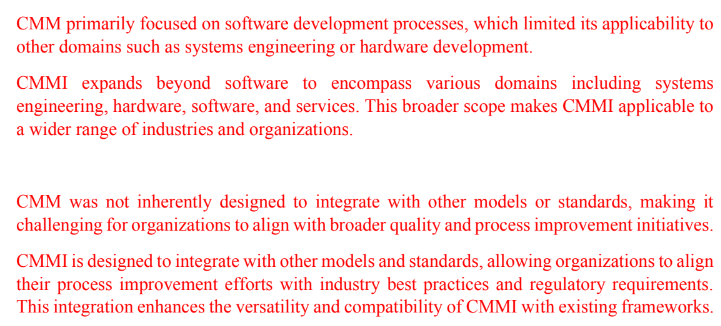

# Q1a
## i
- Verification
  - Are we developing the system right
  - Ensure product meet requirements in a particular phase
- Validation
  - Are we developing the right system
	- Evaluate the final product to check does it meet the requirements of the user

## ii
> V-model only a picture idk how to answer this, not in syllabus gua
- Early detection of defect
- Clear structure and documentation (V-model provides a structured approach)

# Q1b
## i
- Software error is the wrong internal state that provide a sign of some fault
  - Mistakes made by a person
	- Example: The statement shoudl eb executed using an AND keyword but the programmer use a OR keyword instaed, it might not cause the software defect but the result produce is incorrect
- Software defect or fault are bugs or internal errors
  - Can cause none, one or many failures
  - Example: Infinite loop in a software
- Software failure means a requirement that is not fulfilled
  - Can be caused by software faults
  - Example: A user cannot login to the system

## ii
- A software error might indicate that a software fault or defect exists, a software fault or defect can cause none, one or many software failures.

## iii
- Functional testing
  - Functions are tested by feeding input and checking the output
- Smoke testing
  - Test carried out to make sure most important functions work
- Regression testing
  - Repeated testing carried out when the source code has been modified
  
# Q2a
- It is used to ensure that those changes does not affect the other part of the system
- It is used to ensure that the changes meets the requirements
- Discover defects resulted by the changes

# Q2b
## i

## ii

# Q2c

# Q3a
## i
- SQC is a subset of SQA, both of them serve different objective
- SQC: Process of evaluating the product to make sure the product meets its requirements. This process takes place after the product is completed but before being shipped to the customer
- SQA: Objective is to ensure minimize the cost of ensuring the quality of the product. SQA is performed throughout the development process to reduce the rate of shipping unqualified product

## ii
- Plan testing and SQA process
  - Test processes should be well defined and documented, these documents include quality management plan, test plan and test case
- Implement test-oriented management
  - Apply Extreme programming methodology, for example test driven development where tests are created before code is produced
- Ensure suitable working enviroment for the SQA team
  - Respect SQA team
  - Involve SQA team in the beginning to allow start testing early
- Optimize the use of automated testing
  - To increase the productivivty and quality of testing, automated testing should be considered
- Employ code quality measurements
  - Quality objectives should be measureable
- Report bug effectively
  - Good bug reports should be produced to help in clearly identifying the problem

## iii
- Deal with the requirements that affect the maintenance of the system
- Testability
  - Deal with the testing of an information system and its operation including the speacial feature in the system to help the tester and software operations performed by the system prior to start the system
- Flexibility
  - Capabilities and efforts required to support maintenance activities
- Maintainablity
  - Determine the effort needed by user and maintainer

# Q3b

# Q4a
- Customer focus
  - Customer determine the level of quality and the customer will determine the does the changes worth the effort
- Total employee involvement
  - All employee must work towards the same common goal

# Q4b
- Greater cooperation between development team and external participants
- Better mutual understanding and coordination between development team and maintenance team
- Better understanding and cooperation between supplier and customer
- The ability to apply software development and maintenance methodology and procedures of the highest professional level

# Q4c
- Project Process standard
  - Focus on the methodology for carrying out software development and maintenance project
  - Many SQA standard in this class can be served as the software engineering standard and vice versa
  - Examle: Agile methodology
- Quality management standard
  - Focus on the organization's SQA system, infrastructure and requirements, while leaving the choice of the methods and tools to the organization
  - By compling with the quality management standard, organisation can steadily assure that their software product has acchieve an acceptable level of quality 
  - Example: Certification standard, Assessment standard

# Q4d
- Disadvantages
  - Organizations often focus on the next level losing perspective and forgetting the real target is to improve the processes.
  - Does not specify a particular way to achieve the goal. Then, in order to achieve the goal them ones needs to think in a flexible way. The goal can only be achieve if the organizaton process is taken into account
  - CMM only help when it is place in the correct place early in the software development process. Therefore, it cannot be used as an emergency method of recovering from the difficult position.
  - CMM is only concerned with the improvement of management related activity but not with the context of software
- Improvements made in CMMI (Ans not confirmed)
  - 18 Key Process Areas are modified to become 25 Process Areas
  - Process Areas are classified by the capability maturity level, where objectives, specific process and procedures are defined for each process areas

