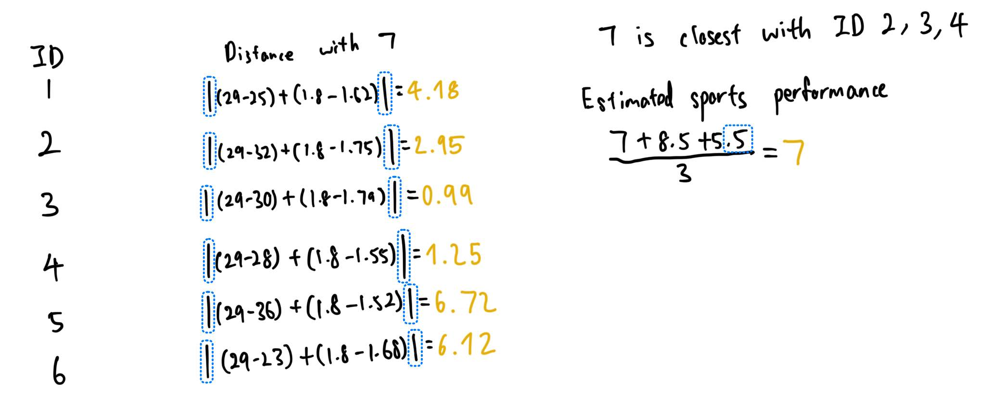
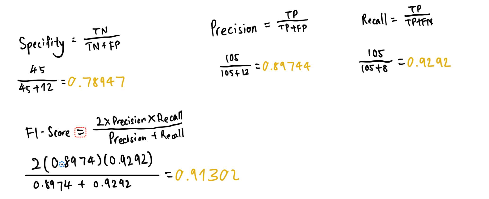
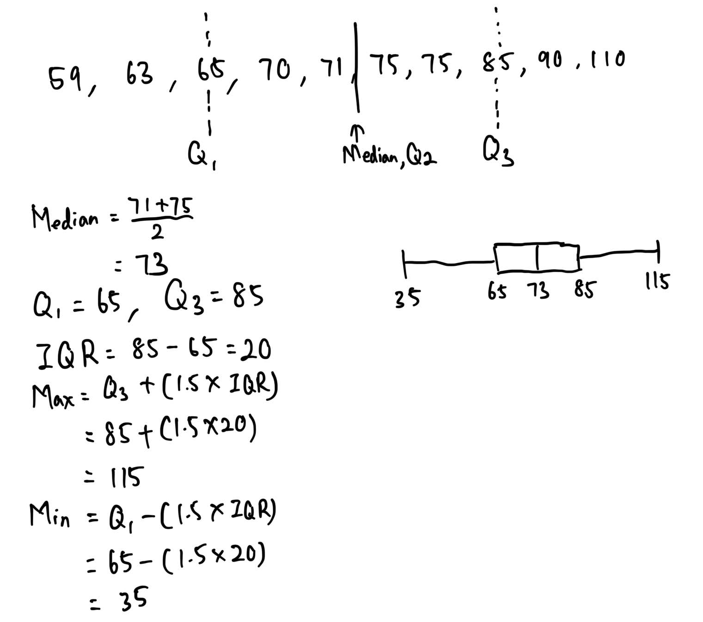
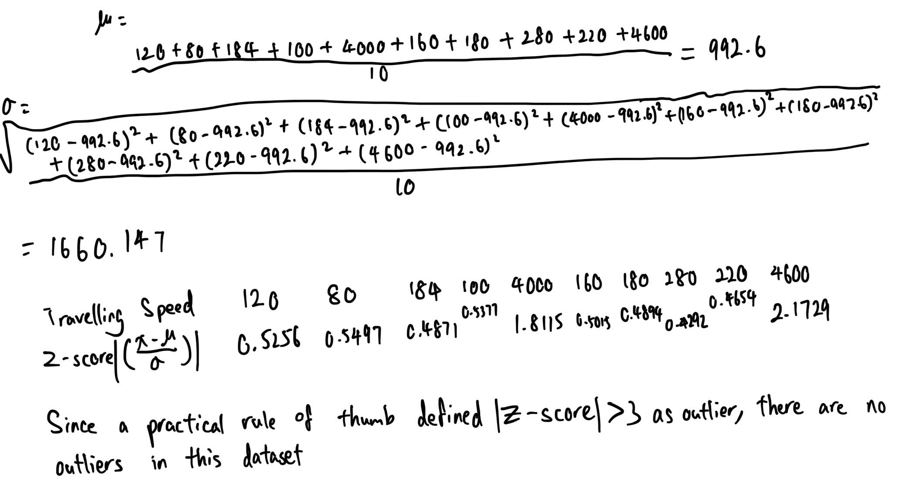
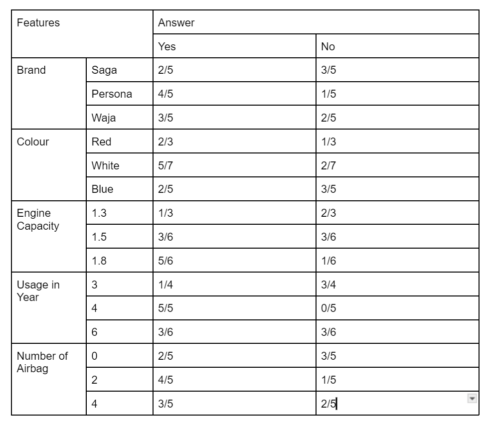

# 1
## a
- In the identify business problem phase, the data scientist will identify the business problem in real world then determine the research can be conducted for the business problem. For example, the data scientist have identified heart disease issue in the society, then data scientist conduct a research on the factors affecting the heart disease. 
- In the identify data source phase, the data scientist will identify the possible data sources that can be used that aligned with the research objective. For example, the data scientist will search through Kaggle website to identify the suitable datasets. 
- In the select the data phase, the data scientist will select the dataset that is suitable for the research objective from the selected data sources. For example, the data scientist will only select one dataset from five data sources. 
- In the clean the data phase, the data scientist will perform data preprocessing on the data so that the result produce is accurate. For example, the data scientist will handle issues such as outliers, missing value, etc. 
- In the transform the data phase, the data scientist will perform data transformation on the data. For example, data scientist will perform categorization and standardization. 
- In the analyse the data phase, the data scientist will build an analytical model with the preprocessed and transformed data to identify patterns in the data. For example, data scientist can build a decision tree model with the preprocessed and transformed data. 
- In the interpret, evaluate, and deploy the model phase, the results obtained will undergo evaluation by the business expert. Once the result is approved, then the model will be used in the business environment. For example, the model is over 95% accuracy, then the model will be used in the business environment. 

## b
### i

### ii
- Overfitting to the train dataset.
	- Overfitting cause the model cannot be generalize enough for unseen data before, therefore it cause the accuracy of the model to decrease whenever the model see a new data as the model cannot correctly identify the result of the unseen data. 
- Bias in dataset. 
	- Bias in dataset might cause the model cannot have a good performance. For example, the dataset that is used to train the model is contain with data from the England. However, the model is applied to the client in Malaysia. As the culture are different between two countries, it make the model is only suitable to predict the situation in England. 

# 2
## a
### i
- Government
  - Crime prediction
  - Policy effectiveness prediction

### ii
- Risk management
	- Risk impact prediction
	- Corrective action impact prediction

### iii
- Web
	- Recommender system
	- User behavior analysis

### iv
- Marketing system
	- Market basket analysis
	- Customer segmentation
  - Customer churn prediction

### v
- Logistics system
	- Route optimization 
	- Delivered time estimation

## b

### iii
- False positive, it means that the actual result is no but the model predicted yes. 
	- False positive is accpetable in the healthcare as it can alert people to further checking their health condition.
	- Altough the result after checking is false, it is better to check the health condition to determine whether there are possible of other disease or not. 
- False negative, it means that the actual is yes but the model predicted no.
	- False negative is not acceptable in the healthcare as once the model predicted no, the people will not further perform body checking for their health condition. 
	- Therefore, the health condition of the people may continue to become worst and ended up missing the best timing to accept treatment. 

# 3
## a

## b

## c
- Box plot
	- The box plot identifies outliers based on the interquartile range (IQR), which is the range between the first quartile (Q1) and the third quartile (Q3) of the dataset.
- Z score
	- The z-score method identifies outliers by calculating the standard score for each data point, which indicates how many standard deviations the point is from the mean. 

- Can We Expect the Same Results?
	- No, we cannot always expect the same results from both methods because:
	- The box plot method focuses on the distribution based on quartiles and is independent of the underlying distribution of the data.
	- The z-score method, on the other hand, relies heavily on the mean and standard deviation, which assumes a normal distribution. This makes the z-score method more suitable for symmetric distributions, while the box plot can detect outliers in skewed data more effectively.

# 4
## a
$$
\begin{aligned}
&P(T | M) = \frac{P(T \cup M)}{P(M)} \\
&= \frac{\frac{12}{100}}{\frac{60}{100}} \\
&= \frac{12}{60}
\end{aligned}
$$

## b
- Association rule is unsperviesed learning
	- In unsupervised learning, the target variable is not given to the model. This is the same with mining assciation rule as we did not know what are the association rule in the dataset. 
	- Finding the association rule is to determine the pattern in the dataset. Therefore it is unsupervised learning

## c
### i
$$
\begin{aligned}
&support(carrot \cup yakult) \\
&= \frac{carrot \cup yakult}{\text{total transaction}}\\
&=\frac{3}{8} 
\end{aligned}
$$

### ii
$$
\begin{aligned}
&confidence(carrot \rarr yakult) \\ 
&= \frac{support(carrot \cup yakult)}{support(carrot)}\\
&=\frac{\frac{3}{8}}{\frac{4}{8}} \\
&=\frac{3}{4}
\end{aligned}
$$

### iii
- There are 75% confidence that, the carrot will be purchase together with Yaklut. 

## d
### i
$$
P(\text{BUY} = \text{YES}) = \frac{9}{15} \\
P(\text{BUY} = \text{NO}) = \frac{6}{15}
$$

### ii

### iii
$$
\begin{aligned}
&P(\text{BUY} = \text{YES} \space | \space \{ SAGA,WHITE,1.3,6,4 \}) \\
&=P(\text{SAGA} | \text{YES})*P(\text{WHITE} | \text{YES})*P(\text{1.3} | \text{YES})*P(\text{6} | \text{YES})*P(\text{4} | \text{YES})*P(\text{YES}) \\
&=\frac{3}{175}
\end{aligned}
$$