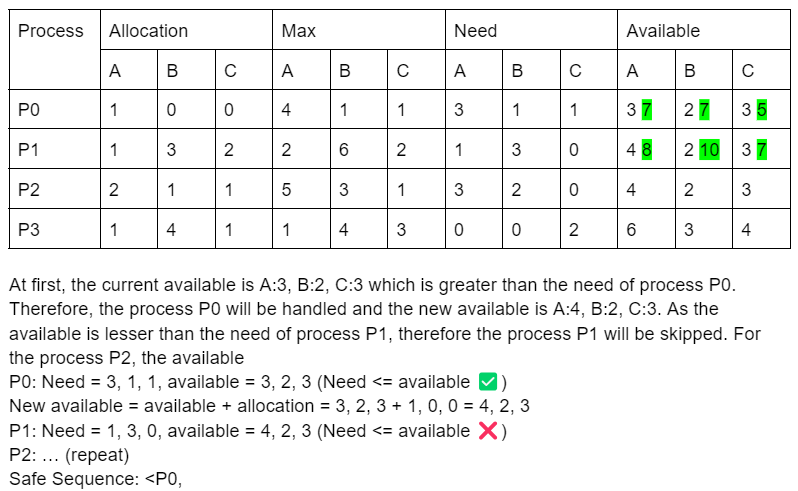

# 1
## a
- server
	- the server is use to handle the request of the client sending back the response according to the request
- cilent
	- the cilent is the one to send the request to the server and waiting the server to handle their request

## b
- peer to peer network
	- Peer to peer network is a type of network where everyone can be a client and also server. In the peer to peer network, if one of the client send the request for a file, other client in the network that contain the file can handle the request by sending the requested file, becoming a server. This way, the peer to peer network is scalable when more computers get into the network.

## c
- advantage
	- the advantage of the client server network is it ensured data integrity. As the file is only stored in the server, it ensure that the file cannot be changed by any other user as user does not have the access to modify the file
- disadvantage
	- the disadvantage of the client server network is it fully depends on the server. Usually there will be only one server in a network, therefore when the server is down due to hardware failure or electrical shortage, other client will not able to make a request to the server. 

## d
- In the peer-to-peer network, the file does not only store in a single place only. The file will be store at any client that has the file. When sharing the file to another client, all other client that contain the file will establish a connection to the client and send the file to the client. 
- As the peer-to-peer network allow every client can also be a server, it make the scalability of the network better than the client server network as increasing the number of nodes (peers) also simulteanously increase the number of servers. This way, it increases potential delivery rate as there can now be multiple nodes sending the requested file. 
- Besides that, the peer-to-peer network have a better resilience than the client server network. As every client can become a server in the peer-to-peer network, it does not rely on only one server like client server network. The everyone can be a server characteristics allow other servers to continue sending the requested file to the client if one of the server is down. However, in the client server network, if the server is down then all client cannot access to the resource anymore.

## e
- avoid single point failure
	- In a distributed system, it is essential to prevent a single component failure from bringing down the entire system. This can be achieved through redundancy and failover mechanisms, where backup components are in place to take over if a primary component fails.
- managing data replication
  - In a distributed system, the system will consist of multiple small part store in different place. Therefore, the data replication will need to be managed so that the system will not store duplication data. 
- ensuring availability and performance
  - Ensuring availability and performance of a distributed system is hard due to a mixed factor of node failures or network latency, thus fault tolerance mechanisms or load balancer should be implemented.
- Binding system components together
  - Establishing and managing connections between different components in a distributed system is essential for communication and coordination. This can be challenging for distributed systems as different components in the system may use different connection protocol standards.
- Resource Naming, Addressing, and Location
  - Locating and accessing resources in a distributed system requires robust mechanisms for naming, addressing, and resource discovery. Distributed naming services, directory services, and service registries are commonly used to address this challenge.

# 2
## a
- Mutex stands for mutual exclusion is a locking mechansim where it does not allow the thread to access the buffer to prevent race conditions. In the multi-threaded environment, every thred can access to the buffer. In order to allow only one thread access the buffer, a mutex will be used. When a mutex is turn to 0, it indicates that the buffer is not available and the thread is not allow to access the buffer. When a mutex is turn to 1, it indicates that the buffer is available and the thread is available to access the buffer.

## b
- Binary semaphore
	- In binary semaphore, it can initial count 0 or 1. 
	- In binary semaphore, there are no concepts of ownership.
- Mutex
	- In mutex, it can only initial count 1.
	- In mutex, there is a concept of ownership.

## c
### i
```cpp
sem.acquire();
sem.acquire();
// critical section operation
sem.release();
```
- All threads will face deadlock

## ii
```cpp
sem.acquire();
// critical section operation
sem.release();
```
- All thread will not face deadlock and race condition

### iii
```cpp
sem.release();
// critical section operation
sem.acquire();
```
- All thread face race condition

### iiv
```cpp
sem.acquire();
// critical section operation
```
- First thread can proceed, then other threads deadlock

## d
```cpp
void pipe_send_msg(Msg &msg) {
  mut.down();
	if (full_count.count != 10) {
		buffer_add_msg(msg);
    full_count.up();
    empty_count.down();
	}
  mut.up();
}

Msg &pipe_receive_msg() {
	mut.down();
  Msg &msg;
	if (empty_count.count != 10) {
		msg = buffer_get();
		full_count.down();
		empty_count.up();
	}
	mut.up();
	return msg;
}
```

# 3
## a
- The purpose of Banker algorithm is to determine whether the process sequence is a safe sequence. A safe sequence is given if the system is able to allocate enough resources and there are no deadlocks.

## b
### i
- A = 8 - 5 =3
- B = 10 - 8 = 2
- C = 7 - 4 = 3

### ii


## c
### i
- Write-after-read (Anti-dependence)
  - Happens when a statement writes to a memory location that a statement before reads from
  - The execution order of the statements is important when implemented in parallel so the outputs will be consistent
  - Example: 
  ```ruby
  S1: a = b+5
  S2: b = 6
  ```
- Write-after-write (Output-dependency)
  - Output dependency means that during program execution, a subsequent operation will overwrite the result of the previous operation.
  - The execution order of the statements is important when implemented in parallel so the outputs will be consistent
  - Example:
  ```ruby
  S1: b = 5
  S2: b = 6
  ```

### iii
- Rename variables
