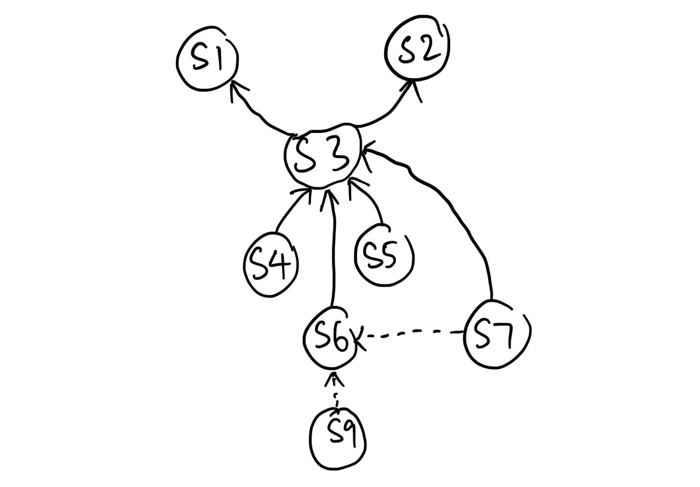

# 1
## a
- The software may be already good enough and do not require a full system replacement, in this case, re-engineering will be more cost effective than purchasing a new system. For example, in this case, only certain parts of the system needs to be changed instead of replacing the whole system with a new one. 
- Change in the entire software may introduce inconvenience and dislike from the existing software. For example, the users may have been already very familiar with how the system works, introducing a new user interface of the system may cause the user to learn through the system again causing them need to waste time.
- New software might not have the specific fucntion that the orginal software have. For example, in the online shopping platform, the visual search function does not provide in the new system however it is a fucntion that the online shopping want to have so they cannot purchase a new system.

## b
- When decompilation of the system, the annotations of the programmer will be missing where the annotations are important to allow the programmer to understand the system. Therefore, when there is no annotations the programmer will need more efforts to understand the code.
- When decompliation is performed, the binary code of the program will be transform to the higher level language that is readable by the programmer. However, the language might not be the same language that is use to develop the programme. As different programming language has they own unique way to handle problem, it might cause the programmer to use their own knowledge to determine the original source code of the system.
- As the system is developed in multiple programming language, therefore the decomplier might not be able to identify the source code is developed using multiple programming language. Therefore, the decompiler try to decomplie the binary code of the system, it might assume the code is written in one language only. Therefore, the source code produce are not be the same to the original source code.
- Decompilation may lead to obfuscated code. In order to produce an optimised software and promote confidentiality, most compilers will obfuscate the code to be less human readable, mainly through means like converting into non-understandable variable naming and aliases. When decompiling, the decompiler might not perfectly reconstruct the original source code, as it has been obfuscated and it would confuse the engineer with the unreadable decompilation result. 

## c
### i
- Respecify. The scope of the system has been changed
- Redesign. The architecture is changed, new algorithm is intoduced
- Recode. The system is implemented in different programming language

### ii
- Longer time to complete as the incremental approach will only introduce part of the modification in each turn
- With many intermediate version is produce, the developement team must be careful with the version control
- If there is a need to change the architecture of the system the architecture also cannot be change

### iii
- Partial approach
- In the partial approach, the system will be separated into two parts: a part that will be reengineered and a part that will not be reengineered.
- This is similar to the situation above where only an independent part of each module will need to be reengineered.
- Therefore, it make the partial approach suitable for the situation above.

# 2
## a
- More cost as you need to operate two system simultaneously when migrating.
- Data inconsitency between system. For example, the old system does not store certain data that is stored such as gender of the user. But the new system got store the gender attribute.

## b
- Developed using obsolete programming language. It require more time for the developers to understand the code.
- Lack of complete documentation. It will cause more time for the developers to identify the requirements for the system.
- Aged. The system usually is more than 10 years, therefore the technology is already outdated and thus the new system will not be able to run on the currently available hardwares running the current system and require purchase of new hardwares.

## c
### i
- The first consideration is to determine whether the open source walkie talkie program can work on the Windows 10 platform. If the open source walkie talkie program cannot work on Windows 10 platform then migration is not possible.
- The second consideration is to determine whether the program can work on Windows 10 platfrom. If the program cannot work on the Windows 10 platfrom the program cannot be migrate.
- The thrid consideration is to determine whether the program can provide all the same funtions that is in Windows 95 platform on Windows 10 platfrom. If the functions cannot be provide in Windows 10 platform migration is not possible.

### ii
- Keep maintaining the system
  - The new technology cannot be implement into the system, rendering the original system to be unable to catch up with the latest trends, losing users
  - The complexity of the system will increased as the keep changing the source code might increase the complexity of the source code then causing the programmer to spend more effort on understanding the system
  - The cost to maintenance will be incrased as the expertise that has the knowledge will be lesser hence they will need to have a higher pay
- Buy a new system everytime
	- The curent system's user might feel not inconvenient as the will need to adapt to new system everytime
	- The new system might not include the all features of the old system hence some good features might not be available in the new system
	- The new system might require higher maintenance cost as the maintenance will need to perform by other developers team

### iii
- Keep maintaining the system
	- This is because the system is very crucial to the to business when purchasing new system the new system that is not customize might not have the function that is required by the business. Hence, it will cause massive impact to the operation of the system.

# 3
## a
- Estimate the cost of the change request
- The determine how the change request is going to impact other parts of the system

## b
- Improvement needed on impact analysis
	- Because the CIS and AIS cosist a large different, indicating there room for improvement for the impact analysis.
- Overlocating resource on handle the change request
	- Because the CIS and AIS cosist a large different, indicating the resource can be optimize hence reduce the cost needed for the change request
- Replanning is needed for the change request
	- Because the CIS and AIS cosist a large different, the orignial planning for handle the change request is overlocating the resoucre for the change request

## c

## d
- Maintainability. By performing the code refactoring, the internal structure of the code is change making it the code more maintainable.
- Modularity. By performing the code refactoring, the internal structure of the code is changed, making the code to be more modular, facilitating reusability of a certain code as well as modularizing (grouping) codes that perform similar functionalities

# 4
## a
- Legal
	- When trying to reuse the component, there might be copyright issue occuring as you are trying to reuse the component especially third party software component.
- Technical
	- The technical limitation might cause the component cannot be reused in other system. For example, the other system may be unable to support the architecture of the component planned to be reused.
- Managerial
	- The top management does not support the reuse of the component
- Benefits: Reduce implementation time. This is because developer does not need to develop the system from nothing.

## b (this answer is referenced from Software Configuration Management, which is highly assumed (big assumptions made))
- The main goal of Service Configuration Management is to manage and control the numerous corrections, extensions and adaptations that are applied to a system over its lifetime, handling control of all products and changes of those products. 
- By applying Service Configuration Management, it is possible to identify every version of every software at various point in time. Thus, when providing an IT service, if the customer demands a rollback to hot fix some issue, it is possible.
- Applying Service Configuration Management also eases software evolution, as all historical record of changes and documentations are retained, allowing analysis to analyse potential points of failure when attempting to evolve the system. 

## c
- Reactive reuse model. 
- As the situation provided mention that the reuse does not occur frequently, therefore reactive reuse model is the most suitable as when the developer team discover there is an oppoturnity to reuse the component and only develop the component that can be reused. As developing the component to be reused require extra effort, planning in advance and develop the component to be ready for reuse is not worth as the chances to reuse the component is not as frequent.

## d
- High implementation cost
  - The initial setup of the framework might require extra cost to be spend so that the process can follow according to the framework.
  - A medium-sized company decides to implement the ITIL framework to improve its IT service delivery. The company purchases a new ITSM software solution costing $100,000, integrates it with their existing systems, and invests in additional hardware upgrades to support the new platform. 
- Higher hiring cost
  - Some of these roles in ITIL framework require experience with ITSM, so the company hires external consultants for recruitment and onboarding, adding to the costs.
  - As you need to hire person that is with the ITSM certification hence the compnay will need to pay a higher salary.
- Overhead from Increased Process Complexity
	- As the company need to introduce new process into the operation, it increase the complexity hence leading to overheads
	- A financial services company implements formal Change Management and Problem Management processes as part of their ITSM framework. Previously, IT changes were handled informally, allowing quick fixes and updates. After implementing ITSM, all changes must go through a formal approval process, requiring multiple approvals, risk assessments, and documentation. As a result, even small changes, like updating a software patch, now take an extra week to be approved and implemented. 