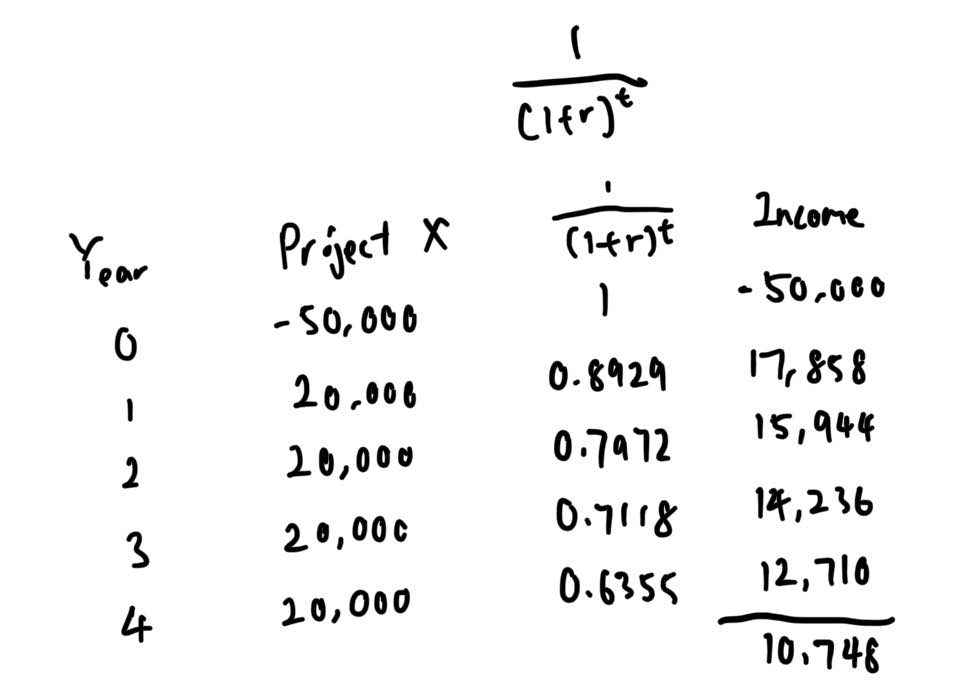
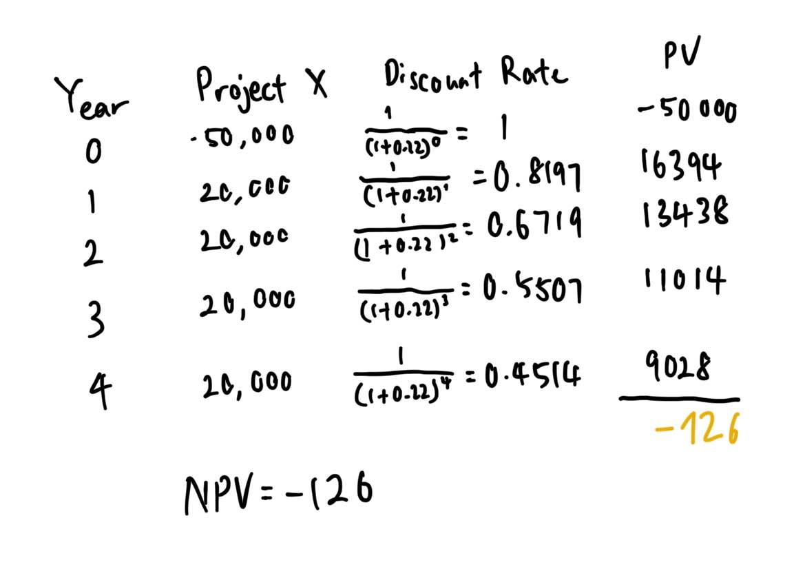
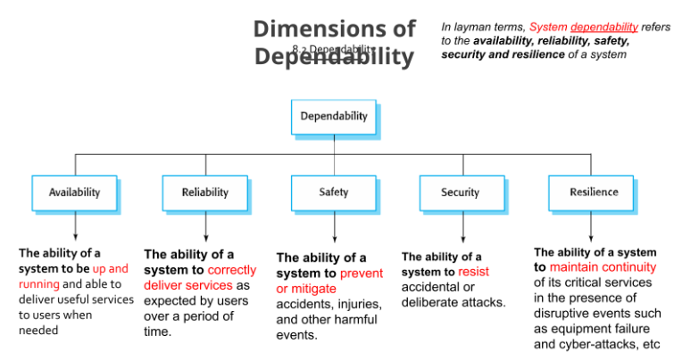

# 1
## a
- Planning is required.
- Projects have a specific objective to be met.
- Project has a specific timeframe/pre-determined time span.
- Project can be a work that is carried out for someone else, like a client.

# 2
## a
### i

- At a discount rate of 12%, a positive NPV indicates that the PV of the cash inflows is greater than the PV of cash outflow over the four year period. This make the project attractive.

### ii

- At a discount rate of 22%, a negative NPV indicates that the PV of the cash inflows is smaller than the PV of cash outflow over the four year period. This make the project should be rejected.

## b
$$
\begin{aligned}
&\text{AC} = 140000
&\text{EV} = 20000 + 20000 + (30000 * 0.8) + (40000 * 0.8) + (40000 * 0.6) = 124000 \\
&\text{SV} = \text{EV} - \text{PV} \\
&\text{SV} = 124000 - 150000 = -26000 \\
&\text{SV} = 140000 \\
&\text{CV} = \text{EV} - \text{AC}
&\text{CV} = 124000 - 140000 = -16000 \\
\end{aligned}
$$
- Based on the schedule variances, the negative value indicates that the project is behind the schedule, meaning the less work is completed compared to the planned work. 
- Based on the cost variances, the negative value indicates that the budget of the project is over spent, meaning that the spending amount is more than the planned budget. 

# 3
## a
- The first process metric consider to collect is time required to complete a process activity.
  - For example, the metric is the time required to develop a component
- The second process metric consider to collect the amount of resource required to complete a process activity.
  - For example, the metric is the amount of efforts needed to develop a component
- The third process metric consider to collect is the number of event occured. 
  - For example, the metric is the number of error occured in the first week of deployment

## b
- The aim to the GQM is to determine what data are needed to be collected.
- The G in the GQM is the Goal meaning what is the goal of this process management. For example, the goal of GQM is to reduce the development time
- The Q in the GQM is the Question meaning question can be asked by developer to determine how to assess improvements. For example, the question iswhat is the time required to deliver a new componente
- The M in the GQM is the Metrics meaning what is the metrics for developer to identify whether the goal is achieved. For example, the metrics is the time required to deliver a new component

## c
- Question: What are the factor contribute to time needed to modify the program
- Metrics: Number of comment line, number line of code, length of the identifier

## d
- Risk Mitigation
	- Break the project into small incrementals and plan the completion date accordingly
	- Identify the external software house to handle the some part of the project
  - Assign right task to right developer with the specific skills
- Risk Monitoring
	- Conduct meeting regularly to identify the current progress of the project
	- Adopt project management tools e.g. gantt chart to see compare the actual progress and plan progress
- Risk Management
	- Assign part of the project to external software house identified
	- Negotiate with client to explore the possibilities of extending the delivery date
	- Reduce the scope of the project

# 4
## a

## b
- More testing needed to be conducted. 
	- To ensure dependability, more the testing are required hence it will generate more cost and time required
- Redundancy and diversity
	- To ensure dependability, redundancy and diversity is ensured so it lead to extra cost needed

## c
